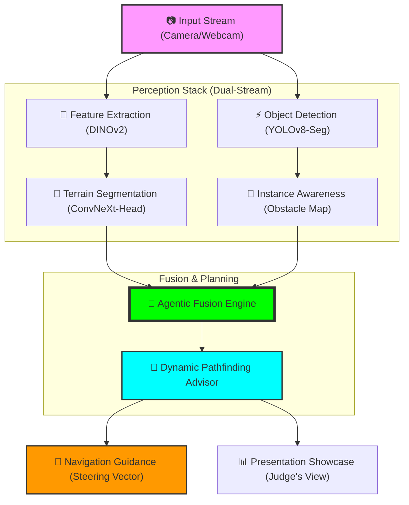

# 🏗️ Nexus Vision: System Architecture & Workflow Report

## 1. System Overview
Nexus Vision is a high-performance situational awareness and autonomous navigation system designed for off-road environments. It uses a **Dual-Stream Agentic Fusion** architecture to perceive both terrain semantics and object instances simultaneously.

---

## 2. System Architecture Diagram

---

## 3. Workflow Breakdown

### Step I: Multi-Stage Perception
- **Terrain Segmentation**: A custom-trained segmentation head processes features from a **DINOv2 (Vision Transformer)** backbone to identify 10 distinct off-road classes (Rocks, Trees, Sand, etc.).
- **Instance Detection**: In parallel, **YOLOv8-Seg** identifies dynamic obstacles (humans, vehicles) and generates high-confidence bounding boxes.

### Step II: Agentic Fusion
The system fuses the semantic terrain map with the object detection stream. This ensures that a "Rock" detected by segmentation is also cross-referenced with any "Obstacle" detected by YOLO, providing redundancy and safety.

### Step III: Dynamic Pathfinding
1.  The 2D perceived world is projected into a 1D **Horizontal Occupancy Map**.
2.  The system identifies the **Optimal Gap** (nearest/shortest path) in the terrain.
3.  A **Steering Vector** is calculated to guide the vehicle toward the safest navigation path.

### Step IV: Real-Time Visualization
The results are presented through a **4-Panel Showcase**:
1.  **Original View**: Raw sensor input.
2.  **Patch View**: How the AI "sees" the image in 14x14 pixel blocks.
3.  **Terrain View**: Color-coded situational semantics.
4.  **Fused View**: Final navigation guidance and obstacle alerts.

---

## 4. Technical Specifications
| Component | Technology | Role |
| :--- | :--- | :--- |
| Backbone | DINOv2 (ViT-Small) | High-dimensional feature extraction |
| Segmentation | ConvNeXt-style Head | Multi-scale terrain classification |
| Detection | YOLOv8-Nano | Real-time object/obstacle awareness |
| Platform | Python / PyTorch / OpenCV | Core execution environment |
| Interface | Nexus Vision Showcase | Presentational layer for stakeholders |
